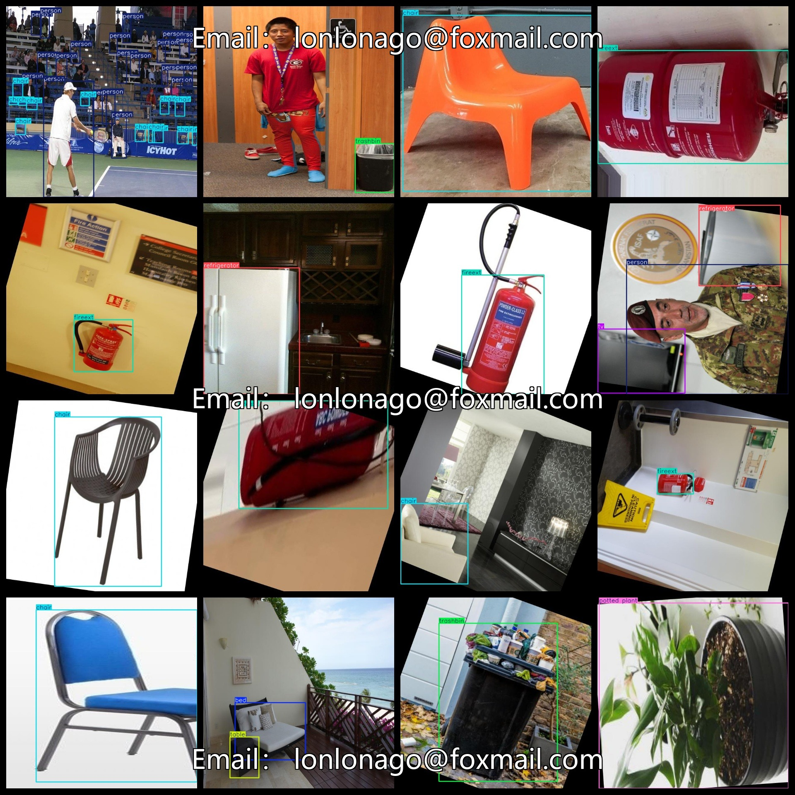
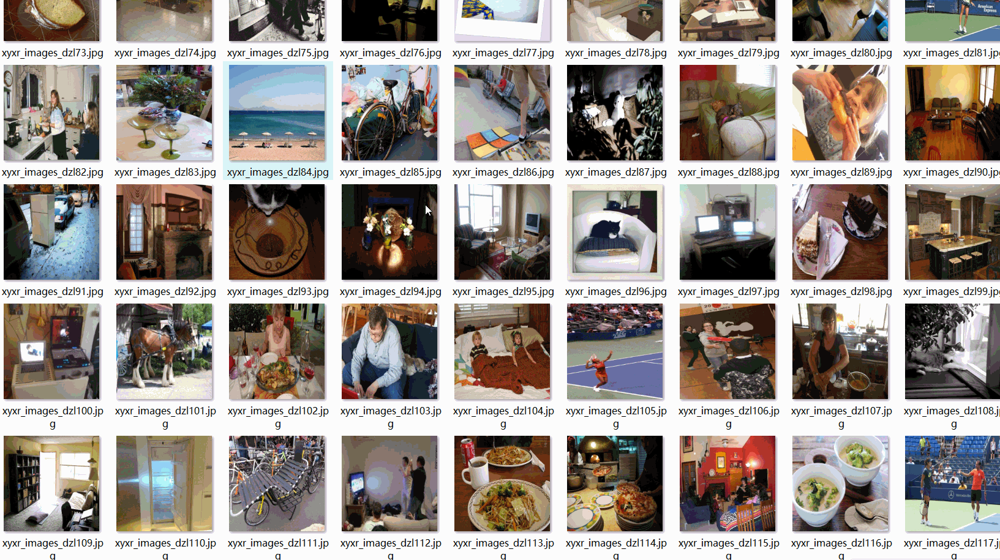

# Living Common Multi Item Detection Dataset 9761 imagesVOC+YOLO format

The dataset format includes both the VOC and YOLO formats. The zip file contains three folders, each storing JPEG images, XML files, and TXT files.

In the JPEGImages folder, there are a total of 9761 JPEG images.

The Annotations folder contains a total of 9761 XML files.

The labels folder has a total of 9761 TXT files.

There are a total of 10 label categories: ["bed", "chair", "couch", "fireext", "person", "potted plant", "refrigerator", "table", "trashbin", "tv"].

The label names are as follows: [“bed”, “chair”, “sofa”, “fireplace”, “person”, “potted plant”, “fridge”, “table”, “trash can”, “TV”].

The number of boxes (note that the order in the YOLO format may differ from this, but it is based on the classes.txt in the labels folder):

bed boxes = 1941

chair boxes = 4669

couch boxes = 2196

fireext boxes = 2196

person boxes = 6831

potted plant boxes = 2119

refrigerator boxes = 1902

table boxes = 2369

trashbin boxes = 2214

tv boxes = 1892

Total box count = 28329

The image resolutions are all clear.

Images have been enhanced.

Label shapes are rectangular bounding boxes used for target detection recognition.

Important Note: No guarantee is made regarding the accuracy or reasonableness of the trained models or weight files provided by this dataset. The dataset only provides accurate and reasonable annotations.

Annotation and image details are as follows:
## Images

---

Here is a pay link on Stripe (https://buy.stripe.com/3cs8yP7sY87d0vu9AB). Please contact me lonlonago@foxmail.com after funding $89, and I will send you a complete data files, thank you!

